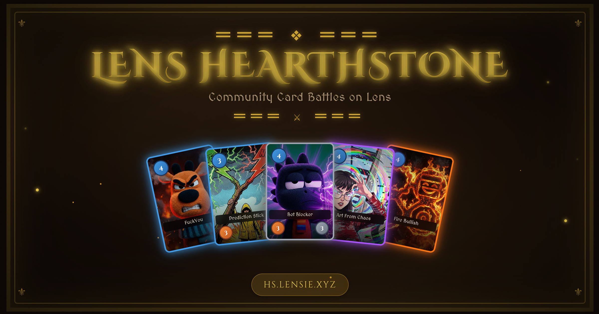
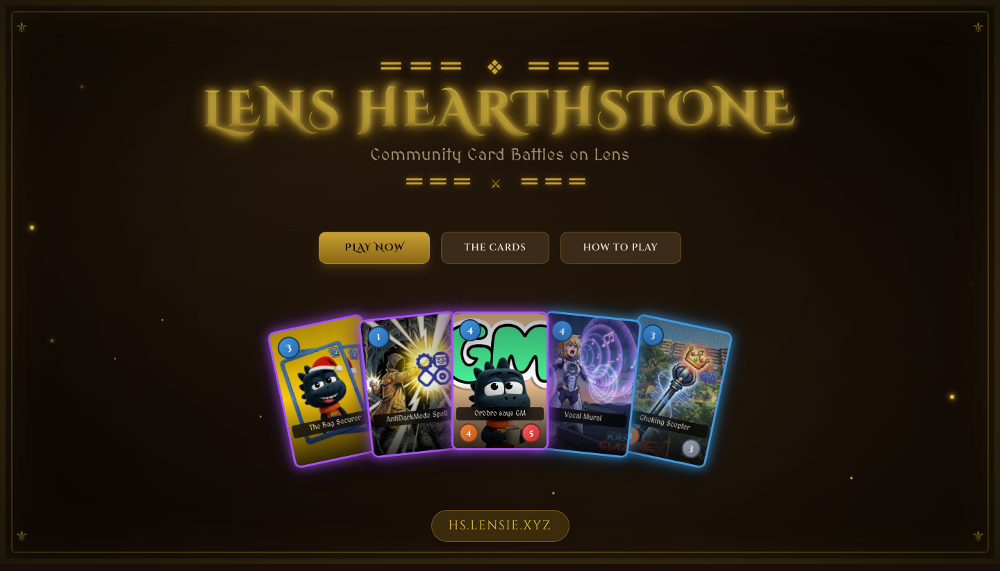
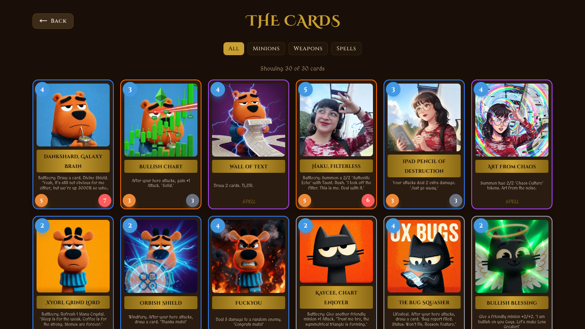
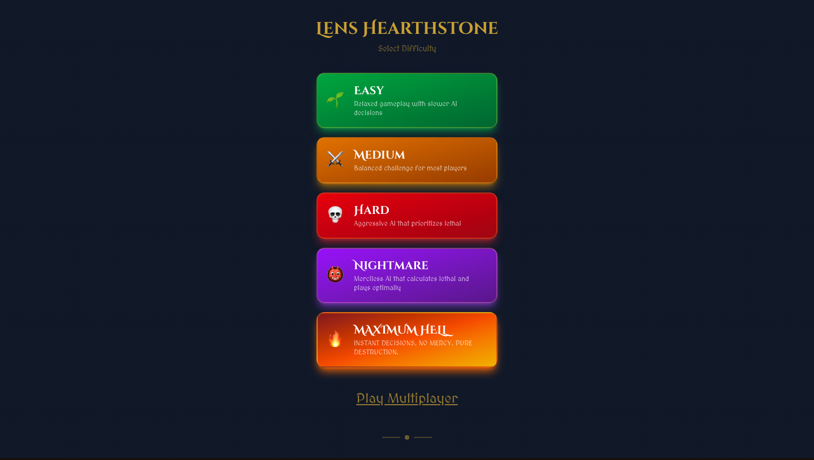
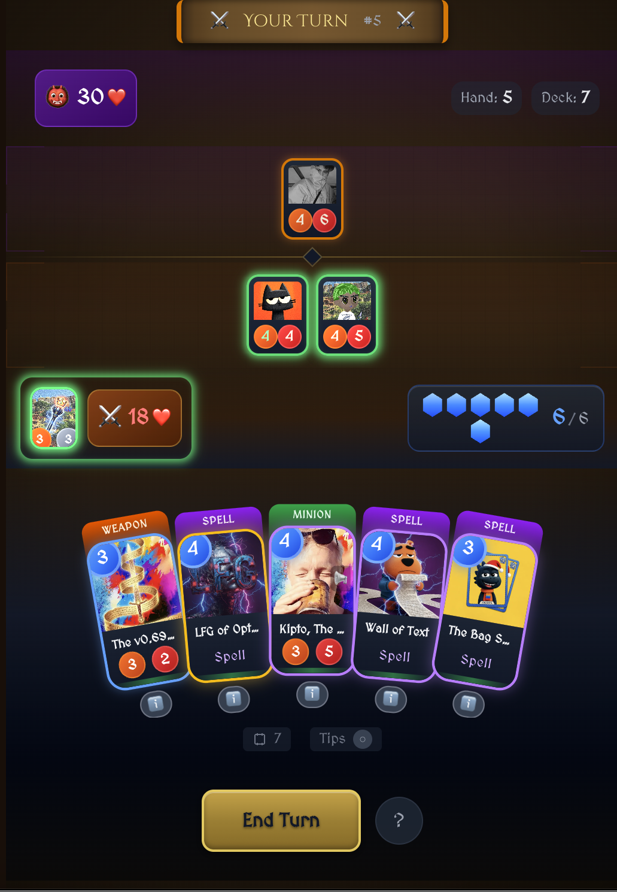

<p align="center">
  
</p>

<h1 align="center">Lens Hearthstone</h1>

<p align="center">
  <strong>A Hearthstone-inspired card game built on Lens Protocol</strong>
</p>

<p align="center">
  <a href="./LICENSE"></a>
  
  
  
  
  
</p>

<p align="center">
  Collect community-created cards, battle an AI opponent across 5 difficulty levels, or challenge other players in real-time multiplayer, all powered by Lens Protocol.
</p>

<p align="center">
  <a href="https://hs.lensie.xyz"><strong>Play Now &rarr;</strong></a>
</p>

---

## Screenshots

<table>
  <tr>
    <td align="center" width="50%">
      
      <br />
      <em>Landing page with rotating card carousel</em>
    </td>
    <td align="center" width="50%">
      
      <br />
      <em>30+ community cards with rarity-based borders</em>
    </td>
  </tr>
  <tr>
    <td align="center" width="50%">
      
      <br />
      <em>5 AI difficulty levels, from Easy to Maximum Hell + MultiPlayer Mode</em>
    </td>
    <td align="center" width="50%">
      
      <br />
      <em>Active game board with minions, spells, and weapons</em>
    </td>
  </tr>
</table>

## Features

**Game Modes**
- Single-player vs AI with 5 difficulty levels (Easy, Medium, Hard, Nightmare, Maximum Hell)
- Real-time multiplayer via WebSocket (PartyKit)
- Interactive tutorial with 8 topics + contextual gameplay tips

**Cards & Combat**
- 30+ community-created cards: Minions, Spells, and Weapons
- 4 rarity tiers: Common, Rare, Epic, Legendary
- 6 keywords: Taunt, Rush, Divine Shield, Lifesteal, Windfury, Battlecry
- Full effect system: buffs, damage, healing, card draw, summoning, destruction

**Web3 Integration**
- Lens Protocol authentication (sign in with your Lens profile)
- Wallet connectivity via wagmi/viem
- Player identity linked to Lens handles and avatars

**Experience**
- Mobile-first, portrait orientation, touch-optimized
- Haptic feedback on interactions
- 16 synthesized sound effects via Web Audio API (zero audio files)
- Rarity-based card glows and animations
- Physics-based animations with Framer Motion

## Quick Start

### Prerequisites

- Node.js 18+
- npm

### Setup

```bash
git clone https://github.com/JaviEzpeleta/lens-hearthstone.git
cd lens-hearthstone
npm install
npm run bundle-cards
npm run dev
```

Open [http://localhost:3000](http://localhost:3000) to play.

### Multiplayer (optional)

To run the multiplayer lobby locally, you need [PartyKit](https://partykit.io):

```bash
npx partykit dev
```

## Environment Variables

Copy `.env.example` to `.env.local` and fill in the values.

### Required

| Variable | Description |
|----------|-------------|
| `NEXT_PUBLIC_WALLETCONNECT_PROJECT_ID` | [WalletConnect](https://cloud.walletconnect.com/) project ID |
| `NEXT_PUBLIC_NETWORK_MODE` | `mainnet` or `testnet` |
| `NEXT_PUBLIC_APP_ADDRESS` | Lens app address (mainnet) |
| `NEXT_PUBLIC_APP_URL` | Your app URL (default: `http://localhost:3000`) |

### Optional

| Variable | Description |
|----------|-------------|
| `NEXT_PUBLIC_PARTYKIT_HOST` | PartyKit host for multiplayer |

> The game is fully playable without the optional variables. Multiplayer requires PartyKit.

## Tech Stack

| Technology | Purpose |
|-----------|---------|
| [Next.js 16](https://nextjs.org/) + [React 19](https://react.dev/) | Framework & UI |
| [TypeScript](https://www.typescriptlang.org/) | Type safety |
| [Tailwind CSS 4](https://tailwindcss.com/) | Styling |
| [PartyKit](https://partykit.io/) | WebSocket multiplayer |
| [Lens Protocol](https://lens.xyz/) | Web3 authentication & identity |
| [wagmi](https://wagmi.sh/) + [viem](https://viem.sh/) | Wallet connectivity |
| [Framer Motion](https://www.framer.com/motion/) | Physics-based animations |
| [Web Audio API](https://developer.mozilla.org/en-US/docs/Web/API/Web_Audio_API) | Synthesized sound effects |

## Project Structure

```
app/                     # Next.js pages & API routes
  page.tsx               # Landing page with card carousel
  the-cards/             # Card collection grid
  play/                  # Single-player game
  play/multiplayer/      # Multiplayer lobby + PvP
  api/                   # REST API endpoints

lib/game/                # Game engine
  reducer.ts             # State machine (all game actions)
  ai.ts                  # AI opponent (5 difficulty levels)
  effects.ts             # Spell/Battlecry effect execution
  combat.ts              # Attack resolution
  keywords.ts            # Keyword mechanics
  sounds.ts              # Web Audio synthesized SFX

components/game/         # Game UI components
components/lobby/        # Multiplayer lobby UI

party/                   # PartyKit WebSocket servers
  lobby.ts               # Online presence + challenges
  game.ts                # Real-time game state sync

public/cards/            # Individual card JSON files (0-32)
```

## Game Mechanics

### Card Types

| Type | Description |
|------|-------------|
| **Minion** | Placed on the board. Has Attack and Health. Can attack each turn. |
| **Spell** | Played from hand for an immediate effect, then discarded. |
| **Weapon** | Equipped to your hero. Grants Attack for direct combat. |

### Keywords

| Keyword | Effect |
|---------|--------|
| **Taunt** | Enemies must attack this minion first |
| **Rush** | Can attack enemy minions (not hero) on the turn it's played |
| **Divine Shield** | Ignores the first instance of damage |
| **Lifesteal** | Heals your hero for damage dealt |
| **Windfury** | Can attack twice per turn |
| **Battlecry** | Triggers an effect when played from hand |

### AI Difficulty

| Level | Behavior |
|-------|----------|
| Easy | Relaxed gameplay with slower AI decisions |
| Medium | Balanced challenge for most players |
| Hard | Aggressive AI that prioritizes lethal |
| Nightmare | Merciless AI that calculates lethal and plays optimally |
| Maximum Hell | Instant decisions. No mercy. Pure destruction. |

## Adding New Cards

1. Create a new JSON file in `public/cards/{id}.json`:

```json
{
  "id": 33,
  "cardType": "MINION",
  "name": "Your Card Name",
  "manaCost": 3,
  "attack": 3,
  "health": 4,
  "keywords": ["Taunt"],
  "abilityText": "Taunt",
  "flavorText": "A witty one-liner.",
  "rarity": "RARE",
  "generatedImageUrl": "/images/cards/33.webp"
}
```

2. Run `npm run bundle-cards` to regenerate `public/all-cards.json`
3. Done! The collection page automatically discovers new cards.

## Scripts

| Command | Description |
|---------|-------------|
| `npm run dev` | Start Next.js dev server |
| `npm run build` | Production build |
| `npm start` | Start production server |
| `npm run lint` | Run ESLint |
| `npm run bundle-cards` | Bundle individual card JSONs into `public/all-cards.json` |

## Contributing

Contributions are welcome! Here are some ways you can help:

- **Report bugs**, Found something broken? [Open an issue](https://github.com/JaviEzpeleta/lens-hearthstone/issues)
- **Submit PRs**, Bug fixes, improvements, and new features
- **Create new cards**, Design cards with unique abilities and flavor text
- **Improve the UI**, Animations, responsive design, accessibility
- **Balance gameplay**, AI tuning, card stats, keyword interactions

## Notes

- `.npmrc` includes `legacy-peer-deps=true` (required for current dependency tree)
- Card images are hosted on an external CDN
- See [CLAUDE.md](./CLAUDE.md) for detailed architecture documentation

## License

[MIT](./LICENSE)
